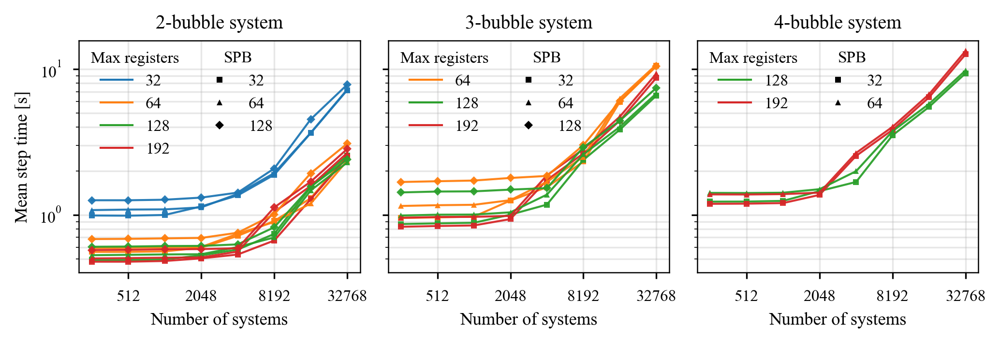
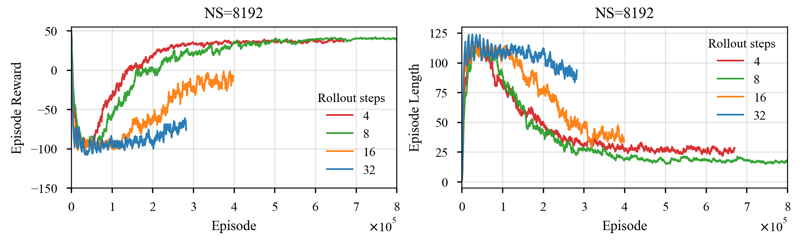

# Coupled Bubble Control

GPU-accelerated simulation and reinforcement-learning control of acoustically coupled bubbles with one-dimensional translational motion.

This repository contains the research code developed for studying the position control of interacting acoustic bubbles using a coupled Keller–Miksis model and Proximal Policy Optimization (PPO).

> **Project status**
>
> This project is considered complete and is no longer under active development.  
> The repository is retained as a research-code snapshot and may still receive a small number of final experiment results or analysis notebooks.
>
> The **Numba/CUDA backend** was used for the main simulation and training experiments.  
> The **CuPy RawKernel backend is experimental, work-in-progress, and has not been fully verified.**

## Overview

The project combines three main components:

- a coupled nonlinear bubble-dynamics model,
- massively parallel GPU simulation,
- reinforcement-learning based position control.

The physical model is based on coupled Keller–Miksis bubble dynamics with translational motion in one spatial dimension. Multiple bubbles interact through the coupled model while external acoustic-field parameters can be used as control inputs.

The simulation is wrapped in a vectorized reinforcement-learning environment, allowing a large number of independent bubble systems to be evaluated concurrently on the GPU.

A custom PyTorch implementation of PPO is included for training continuous control policies.

## Main features

- Coupled Keller–Miksis bubble dynamics
- Radial and 1D translational bubble motion
- Multi-bubble interaction
- Configurable acoustic excitation
- Adaptive GPU time integration
- Large numbers of parallel simulation environments
- Numba/CUDA simulation backend
- PyTorch-based PPO implementation
- GPU-resident rollout and environment data
- Trajectory collection and visualization
- Numerical model verification scripts
- CUDA profiling and simulation-time benchmarks
- Experimental CuPy RawKernel backend

## Performance

The simulation backend was designed primarily for high-throughput reinforcement-learning workloads, where thousands of independent coupled bubble systems can be simulated concurrently.

Representative measurements obtained on an NVIDIA Tesla P100 are shown below.



The benchmark scripts and profiling utilities used during development can be found under [`scripts/benchmarks`](scripts/benchmarks).

## Reinforcement learning

The position-control problem is implemented as a vectorized environment in which the acoustic excitation is modified by the agent and the resulting coupled bubble dynamics are integrated directly on the GPU.

Training is performed using a custom PPO implementation written in PyTorch.

A representative training history for 2 coupled bubbles with 8192 parallel systems is shown below.



Example training entry points and experiment configurations are available under:

```text
scripts/train_pos_control/
```

including the PPO training script and experiment configuration files.

## Example trajectories

Simulation and training trajectories can optionally be stored for later analysis and visualization.


A lightweight trajectory viewer is included in:

```text
trajectory_viewer/
```

## Repository structure

```text
coupled-bubble-control/
│
├── coupledbubble_control/
│   ├── backends/
│   │   ├── numba/          # Numba/CUDA implementation
│   │   └── cupy_cuda/      # Experimental CuPy RawKernel backend
│   │
│   ├── envs/               # Vectorized RL environments
│   ├── models/             # Coupled bubble models and buffers
│   ├── reference/          # Reference implementations
│   └── rl/                 # PPO and RL utilities
│
├── scripts/
│   ├── benchmarks/         # CUDA profiling and performance tests
│   ├── train_pos_control/  # PPO training experiments
│   ├── CKM1D_ParameterStudy/
│   └── CKM1D_Pointwise/
│
├── notebooks/
│   └── figs/
│
├── trajectory_viewer/
│
└── doc/
    └── figures/            # Figures used by this README
```

## Backend status

| Backend | Status | Notes |
|---|---|---|
| Numba / CUDA | Main implementation | Used for model verification, simulation benchmarks and RL experiments |
| CuPy RawKernel | Experimental | Development implementation; not fully verified |

The RawKernel backend was developed as an experiment in reducing overhead and increasing control over CUDA kernel execution. It should currently be treated as research/development code rather than a validated replacement for the Numba implementation.

## Model verification

Reference implementations and dedicated verification scripts are included for comparing numerical solutions and parameter studies.

Relevant locations include:

```text
coupledbubble_control/reference/
notebooks/model_verification.ipynb
scripts/CKM1D_ParameterStudy/
scripts/CKM1D_Pointwise/
```

These were primarily used during development to validate the GPU implementation and investigate numerical behaviour.

## Notes

This repository contains **research code rather than a maintained software package**.

The implementation evolved together with the numerical experiments, GPU profiling and reinforcement-learning studies. Some development utilities, exploratory scripts and notebooks are intentionally retained because they document the experimental workflow.

The code should therefore not be considered a production-ready general-purpose bubble-dynamics solver.